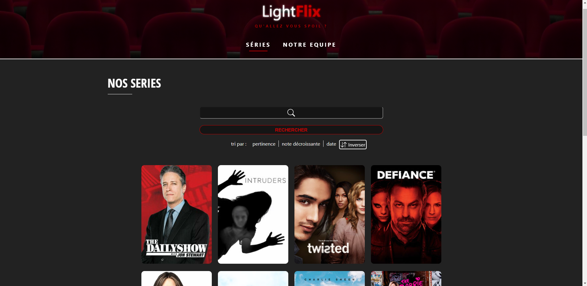

LightFlix
Qu'allez vous spoil ?

Noé DELCROIX - Cyril DEMAND - Constant VENNIN
Groupe I

Pour faire tourner le projet :
- Installer Node.js pour pouvoir lancer des commande npm dans son terminal
- faire la commande "npm i"
- puis dans deux terminaux séparés faire "npm run watch" & "npx serve -s -l 8000"
- Acceder au site via l'url : http://localhost:8000/

Quelques captures d'écrans :

Liste des séries

Informations sur la série

Page de détail

Notre équipe
